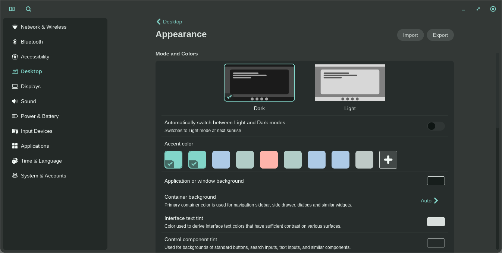
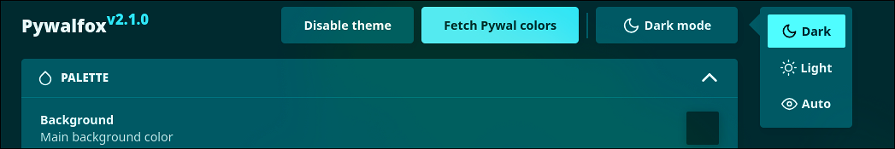

<svg xmlns="http://www.w3.org/2000/svg" height="16" width="12" viewBox="0 0 384 512"><!--!Font Awesome Free 6.5.1 by @fontawesome - https://fontawesome.com License - https://fontawesome.com/license/free Copyright 2024 Fonticons, Inc.--><path opacity="1" fill="#ffffff" d="M162.4 6c-1.5-3.6-5-6-8.9-6h-19c-3.9 0-7.5 2.4-8.9 6L104.9 57.7c-3.2 8-14.6 8-17.8 0L66.4 6c-1.5-3.6-5-6-8.9-6H48C21.5 0 0 21.5 0 48V224v22.4V256H9.6 374.4 384v-9.6V224 48c0-26.5-21.5-48-48-48H230.5c-3.9 0-7.5 2.4-8.9 6L200.9 57.7c-3.2 8-14.6 8-17.8 0L162.4 6zM0 288v32c0 35.3 28.7 64 64 64h64v64c0 35.3 28.7 64 64 64s64-28.7 64-64V384h64c35.3 0 64-28.7 64-64V288H0zM192 432a16 16 0 1 1 0 32 16 16 0 1 1 0-32z"/></svg>

<div align="center">
     
     <br><br>
     
     <br><br>
     
     
     <br>
     <a href="#templates-for-websites">Websites</a>
    ·
    <a href="#templates-for-programs">Programs</a>
    ·
    <a href="#-------------------------acknowledgements">Acknowledgements</a>
</div>

<div align="center">
  
</div>

## Templates for websites

### List of all websites
- [YouTube](./websites/youtube.css)
- [Bitwarden](./websites/bitwarden.css)
- [GitHub](./websites/github.css)

### Using with firefox based browsers


1. Go to `about:config` and set `toolkit.legacyUserProfileCustomizations.stylesheets` to `true`
2. Find your profile directory by going to `about:support`. Under "Application Basics", find "Profile Directory" and click "Open Directory"
3. Make a folder inside of that directory called `chrome`
4. Make sure to replace any of the paths you import according to your profile path
5. Copy the template from [here](https://github.com/InioX/matugen-themes/blob/main/templates/firefox-colors.css) and add it to matugen
   ```toml
	[templates.firefox-website-colors]
	input_path = "path/to/template/"
	output_path = "~/path/to/profile/colors.css"
   ```
6. Copy all of the website themes from [here](https://github.com/InioX/matugen-themes/tree/main/websites) and put them into `chrome/websites`
7. Make a new file called `UserContent.css` inside of the created folder
8. Import the matugen colors
   ```css
	@import url("/home/username/path/to/profile/chrome/colors.css");
   ```
10. Add your imports for each website theme
	```css
	@import url("/home/username/path/to/profile/chrome/websites/bitwarden.css");
	@import url("/home/username/path/to/profile/chrome/websites/github.css");
	@import url("/home/username/path/to/profile/chrome/websites/youtube.css");
	```

> [!WARNING]
> Make sure the replaced paths are absolute (`/home/user`) instead of relative (`~/`)
> Using relative paths will not import anything.

#### Example `UserContent.css` file

```css
@import url("/home/ini/.floorp/ini/chrome/colors.css");

@import url("/home/ini/.floorp/ini/chrome/websites/bitwarden.css");
@import url("/home/ini/.floorp/ini/chrome/websites/github.css");
@import url("/home/ini/.floorp/ini/chrome/websites/youtube.css");
```

## Templates for programs

#### List of all templates
- [Alacritty](#alacritty)
- [ANSI sequences](#ansi-sequences)
- [Btop](#btop)
- [Cava](#cava)
- [Cosmic](#cosmic)
- [Clipse](#clipse)
- [Dunst](#dunst)
- [Fuzzel](#fuzzel)
- [Ghostty](#ghostty)
- [GTK (3.0, 4.0)](#gtk)
- [Helix](#helix)
- [Heroic Games Launcher](#heroic)
- [Hyprland & Hyprlock](#hyprland)
- [Kitty](#kitty)
- [Kvantum](#kvantum)
- [Labwc](#labwc)
- [Mako](#mako)
- [McFly](#mcfly)
- [MangoWC](#mangowc)
- [Micro](#micro)
- [Midnight Discord](#midnight-discord)
- [Neovim](#neovim)
- [Niri](#niri)
- [Opencode](#opencode)
- [PrismLauncher](#prismlauncher)
- [Pywalfox](#pywalfox)
- [Qt (qt5, qt6)](#qt)
- [Quickshell](#quickshell)
- [Rmpc](#rmpc)
- [Rofi](#rofi)
- [Spicetify Sleek (Spotify)](#spicetify-sleek)
- [Starship](#starship)
- [Sway](#sway)
- [Television](#television)
- [Tmux](#tmux)
- [Zellij](#zellij)
- [Vivaldi](#vivaldi)
- [Waybar](#waybar)
- [WezTerm](#wezterm)
- [Windows Terminal](#windows-terminal)
- [Wine](#wine)
- [Wlogout](#wlogout)
- [Yazi](#yazi)
- [Zathura](#zathura)
- [Zed](#zed)
- [Wofi](#wofi)
- [SwayNC](#swaync)
- [Steam](#steam)
- [OBS](#obs)
- [Telegram](#telegram)

### Alacritty
```toml
[config]
# ...
[templates.alacritty]
input_path = 'path/to/template'
output_path = '~/.config/alacritty/colors.toml'
# ...
```
Then, add this line to your `~/.config/alacritty/alacritty.toml`

```toml
import = ["colors.toml"]
```

### ANSI Sequences
```toml
[config]
# ...
[templates.terminal-sequences]
input_path = 'path/to/template'
output_path = "~/.cache/terminal-sequences"
post_hook = "cat ~/.cache/terminal-sequences > /dev/pts/[0-9]*" # export the sequences to every running terminal
```

The target for post_hook changes depending on your OS.
- **Linux**: "/dev/pts/[0-9]*"
- **MacOS**: "/dev/ttys00[0-9]*"


Then, in a profile script of your choice, put `[[ -f ~/.cache/color-sequences ]] && (cat ~/.cache/color-sequences &)`


### Btop
```toml
[config]
# ...
[templates.btop]
input_path = 'path/to/template'
output_path = '~/.config/btop/themes/matugen.theme'
post_hook = 'pkill -USR2 btop || true'
# ...
```
Then, choose `matugen` theme from btop settings.

### Cava
```toml
[config]
# ...
[templates.cava]
input_path = '~/.config/matugen/templates/cava-colors.ini'
output_path = '~/.config/cava/themes/your-theme'
post_hook = 'pkill -USR1 cava'
# ...
```
Then, update the theme variable `theme = 'none'` in the cava configuration file `~/.config/cava/config` with the output_path filename:

```toml
theme = 'your-theme'
```

### Cosmic
```toml
[config]
# ...
[templates.cosmic]
input_path = './templates/cosmic_theme.ron'
output_path = '~/.config/matugen/themes/matugen_cosmic.theme.ron'
post_hook = "~/.config/matugen/templates/cosmic_postprocess.py ~/.config/matugen/themes/matugen_cosmic.theme.ron"
# ...
```
Then, in Cosmic Settings app, under Desktop -> Appearance, click import and select the theme located at `~/.config/matugen/themes/matugen_cosmic.theme.ron` It will build several config files derived from the matugen colors. Cosmic is new and still in development, so updates may break things throughout the beta. Opacity is not yet in the Cosmic gui, but you can set it in the matugen template file and the theme builder will apply it.



### Clipse
```toml
[config]
# ...
[templates.clipse]
input_path = './templates/clipse-colors.json'
output_path = '~/.config/clipse/custom_theme.json'
# ...
```

### Dunst
```toml
[config]
# ...
[templates.dunst]
input_path = 'path/to/template'
output_path = '~/.config/dunst/dunstrc'
post_hook = 'dunstctl reload'
# ...
```

### Fuzzel
```toml
[config]
# ...
[templates.fuzzel]
input_path = 'path/to/template'
output_path = '~/.config/fuzzel/colors.ini'
# ...
```
Then, add this line to the top of your `~/.config/fuzzel/fuzzel.ini` file:

```ini
[main]
include = "~/.config/fuzzel/colors.ini"
```

### Ghostty
```toml
[config]
# ...
[templates.ghostty]
input_path = 'path/to/template'
output_path = '~/.config/ghostty/themes/Matugen'
post_hook = 'pkill -SIGUSR2 ghostty'
# ...
```
Then, add this line to your `~/.config/ghostty/config`:

```ini
theme = "Matugen"  
```

### GTK
```toml
[config]
# ...
[templates.gtk3]
input_path = 'path/to/template'
output_path = '~/.config/gtk-3.0/colors.css'
post_hook = 'gsettings set org.gnome.desktop.interface gtk-theme ""; gsettings set org.gnome.desktop.interface gtk-theme adw-gtk3-{{mode}}'

[templates.gtk4]
input_path = 'path/to/template'
output_path = '~/.config/gtk-4.0/colors.css'
# ...
```
Then, add this line to the top of your `~/.config/gtk-3.0/gtk.css` and `~/.config/gtk-4.0/gtk.css`:

```css
@import 'colors.css';
```

### Helix
```toml
[config]
# ...
[templates.helix]
input_path = 'path/to/template'
output_path = '~/.config/helix/themes/matugen.toml'
# ...
```
Then, add this line to your `~/.config/helix/config.toml`:

```toml
theme = "matugen"
```

### Heroic
```toml
[templates.heroic]
input_path = 'path/to/template'
output_path = 'your/own/path/to/matugen.css'
# ...
```

Then, go to `Settings`, add your output_path directory to `Custom Themes Path` and select `matugen.css`.

### Hyprland
```toml
[config]
# ...
[templates.hyprland]
input_path = 'path/to/template'
output_path = '~/.config/hypr/colors.conf'
# ...
```
Then, add this line to the top of your `~/.config/hypr/hyprland.conf` and/or `~/.config/hypr/hyprlock.conf` file:

```hyprlang
source = colors.conf
```

### Kitty
```toml
[config]
# ...
[templates.kitty]
input_path = 'path/to/template'
output_path = '~/.config/kitty/themes/Matugen.conf'
post_hook = "kitty +kitten themes --reload-in=all Matugen"
# ...
```

Then, you just need to apply the theme once. Run `kitten themes` and select Matugen under the User section, finally just set it to update your `kitty.conf`.

### Kvantum
```toml
[config]
# ...
[templates.kvantum_kvconfig]
input_path = './templates/kvantum-colors.kvconfig'
output_path = '~/.config/Kvantum/matugen/matugen.kvconfig'

[templates.kvantum_svg]
input_path = './templates/kvantum-colors.svg'
output_path = '~/.config/Kvantum/matugen/matugen.svg'
# ...
```
Then, add the following in your ` ~/.config/Kvantum/kvantum.kvconfig` file:

```kvconfig
[General]
theme=matugen
```

### Labwc
```toml
[config]
# ...
[templates.labwc]
input_path = 'path/to/template'
output_path = '~/.config/labwc/themerc-override'
post_hook = 'labwc -reload'
# ...
```

### Mako
```toml
[config]
# ...
[templates.mako]
input_path = 'path/to/template'
output_path = '~/.config/mako/mako-colors'
post_hook = 'makoctl reload'
# ...
```
Then, add this line to the bottom of your `~/.config/mako/config` file:

```ini
include=~/.config/mako/mako-colors
```

### McFly
```toml
[config]
# ...
[templates.mcfly]
input_path = 'path/to/template'
output_path = '~/.local/share/mcfly/config.toml'
# ...
```

> [!NOTE]
> McFly's color parser does not support hex values — only crossterm named colors
> (e.g. `"dark_blue"`, `"grey"`) are accepted. Named colors are resolved by the
> terminal emulator, so pairing this template with a terminal theme (e.g. Kitty)
> generated by matugen will keep the accent color in sync with the wallpaper.

McFly will automatically pick up the config file from this location and use the colors. You don't have do to anything else.

### MangoWC
```toml
[config]
# ...
[templates.mango]
input_path = 'path/to/template'
output_path = '~/.config/mango/colors.conf'
post_hook = 'mmsg -d reload_config' 
# ...
```
Then, add this line to your `~/.config/mango/config.conf` file:

```conf
source=~/.config/mango/colors.conf
```

### Micro
```toml
[config]
# ...
[templates.micro]
input_path = 'path/to/template'
output_path = '~/.config/micro/colorschemes/matugen.micro'
# ...
```

Then, prss `Ctrl+E` in micro editor and enter `set colorscheme matugen`

### Midnight Discord
```toml
[config]
# ...
[templates.vesktop]
input_path = 'path/to/template'
output_path = '~/.config/vesktop/themes/midnight-discord.css'
```

> [!NOTE]
> ``output_path`` may be different if you are using Flatpak version of Vesktop.

Then, activate the theme from vencord themes.

### Neovim

Styling Neovim with matugen is an involved process due to working with plugins and various highlight groups. For information on how to leverage plugins for doing the "heavy-lifting", see [here](./templates/neovim).

Alternatively, you can style Neovim through its configuration standard in `.vim` format.
```toml
[config]
# ...
[templates.nvim]
input_path = 'path/to/templates/nvim-colors.vim'
output_path = '~/.config/nvim/colors/matugen.vim'
post_hook = 'pkill -SIGUSR1 nvim'
```

Then, add the following lines to your `~/.config/nvim/init.vim` file:
```vimscript
colorscheme matugen
autocmd Signal SIGUSR1 colorscheme matugen
```

If you instead use an `init.lua` file at this position, use:
```lua
vim.cmd("colorscheme matugen")
vim.api.nvim_create_autocmd("Signal", {
    pattern = "SIGUSR1",
    command = "colorscheme matugen",
})
```

### Niri
```toml
[config]
# ...
[templates.niri]
input_path = 'path/to/templates/niri-colors.kdl'
output_path = '~/.config/niri/colors.kdl'
post_hook = 'niri msg action load-config-file'
# ...
```
Then, update your `~/.config/niri/config.kdl` file:

```kdl
layout {
    // other values

    focus-ring{
      off
    }

    background-color "transparent"
    border {
        width 3
    }
  shadow {} // border and shadow need to at least be initialized inorder to recieve the include values
}

include "./colors.kdl"
```

### OpenCode
```toml
[config]
# ...
[templates.opencode]
input_path = '~/.config/matugen/templates/opencode.json'
output_path = '~/.config/opencode/themes/matugen.json'
# ...
```
In OpenCode use '/theme', select matugen, exit and restart the app. Since options are all loaded into memory at runtime, there is no on-the-fly changes to the theme. 

### PrismLauncher
```toml
[config]
# ...
[templates.prismlauncher]
input_path = '~/.config/matugen/templates/prismlauncher.json'
output_path = '~/.local/share/PrismLauncher/themes/Matugen/theme.json'
# ...
```
In PrismLauncher, to set the theme, navigate to settings, then appearance, where you can set the theme to "Matugen" and apply it.


### Pywalfox
```toml
[config]
# ...
[templates.pywalfox]
input_path = 'path/to/template'
output_path = '~/.cache/wal/colors.json'
post_hook = 'pywalfox update'
# ...
```

> [!NOTE]
> Add the [Pywalfox plugin](https://addons.mozilla.org/en-US/firefox/addon/pywalfox/) to firefox / thunderbird. <br>
> Dependencies: [pywalfox](https://github.com/frewacom/pywalfox) <br>

#### Theme switching in pywalfox require manual intervention:
- If you want to use **light** mode, with matugen generate colors with `-m light` flag
- If you want to use **dark** mode, with matugen generate colors with `-m dark` flag
- Within **pywalfox setting** you also need to set the corresponding mode "dark/light":
> [!NOTE] Auto here doesnt follow your matugen theme, its based on time of day


### Qt 

> [!WARNING]
> If your QT themes break when you update your system its most likely your qt libs are mismatched between `qtxct-kde` application and qt lib packages installed on the system. To fix this you just need to recompile the application.

```toml
[config]
# ...
[templates.qt5ct]
input_path = 'path/to/template'
output_path = '~/.config/qt5ct/colors/matugen.conf'

[templates.qt6ct]
input_path = 'path/to/template'
output_path = '~/.config/qt6ct/colors/matugen.conf'
# ...
```
Then, add these two lines to the top of your `~/.config/qt5ct/qt5ct.conf` file:

```conf
[Appearance]
color_scheme_path=yourusername/.config/qt5ct/colors/matugen.conf
custom_palette=true
```

For another method, the output path needs to be `~/.local/share/color-schemes/` in order for qt*ct to be able to find the color sheme

```toml
[config]
# ...
[templates.color-scheme]
input_path = '~/.config/matugen/templates/Matugen.colors'
output_path = '~/.local/share/color-schemes/Matugen.colors'
# ...
```
Then, pick a style you would like to use like `kde` or `Darkly` and ajust the code below, adding those lines to the top of `~/.config/qt5ct/qt5ct.conf` and `~/.config/qt6ct/qt6ct.conf`:

```ini
color_scheme_path=~/.local/share/color-schemes/Matugen.colors
custom_palette=true
icon_theme=breeze
style=<Breeze or Darkly>
```

Finally, make sure you have this environment variable `QT_QPA_PLATFORMTHEME` set to `qt6ct`.

> [!Note]
> for the theme to work you need to install the following <br>
> Arch Linux (AUR):
> - `yay -S breeze-icons breeze-gtk qt6ct-kde qt5ct-kde` <br>

For a kde style look download the following packages (Arch):
```
pacman -S breeze breeze5
```

For a cleaner style download the following packages (Arch):
```
yay -S darkly-bin
```

### Quickshell
```toml
[config]
# ...
[templates.quickshell]
input_path = 'path/to/template'
output_path = '~/.local/state/quickshell/generated/colors.json'
# ...
```

Now create `Colors.qml` in your config
```qml
pragma Singleton

import QtQuick
import Quickshell
import Quickshell.Io

Singleton {
	property alias md3: jsonAdapter.md3
	property alias base16: jsonAdapter.base16
	property alias palette: jsonAdapter.palette

	FileView {
		path: Quickshell.env("HOME") + "/.local/state/quickshell/generated/colors.json"
		watchChanges: true
		onFileChanged: reload()

		JsonAdapter {
			id: jsonAdapter

			readonly property Md3 md3: Md3 {}
			readonly property Base16 base16: Base16 {}
			readonly property Palette palette: Palette {}
		}
	}

	component Md3: JsonObject {
		property string background: "transparent"
		property string error: "transparent"
		property string error_container: "transparent"
		property string inverse_on_surface: "transparent"
		property string inverse_primary: "transparent"
		property string inverse_surface: "transparent"
		property string on_background: "transparent"
		property string on_error: "transparent"
		property string on_error_container: "transparent"
		property string on_primary: "transparent"
		property string on_primary_container: "transparent"
		property string on_primary_fixed: "transparent"
		property string on_primary_fixed_variant: "transparent"
		property string on_secondary: "transparent"
		property string on_secondary_container: "transparent"
		property string on_secondary_fixed: "transparent"
		property string on_secondary_fixed_variant: "transparent"
		property string on_surface: "transparent"
		property string on_surface_variant: "transparent"
		property string on_tertiary: "transparent"
		property string on_tertiary_container: "transparent"
		property string on_tertiary_fixed: "transparent"
		property string on_tertiary_fixed_variant: "transparent"
		property string outline: "transparent"
		property string outline_variant: "transparent"
		property string primary: "transparent"
		property string primary_container: "transparent"
		property string primary_fixed: "transparent"
		property string primary_fixed_dim: "transparent"
		property string scrim: "transparent"
		property string secondary: "transparent"
		property string secondary_container: "transparent"
		property string secondary_fixed: "transparent"
		property string secondary_fixed_dim: "transparent"
		property string shadow: "transparent"
		property string surface: "transparent"
		property string surface_bright: "transparent"
		property string surface_container: "transparent"
		property string surface_container_high: "transparent"
		property string surface_container_highest: "transparent"
		property string surface_container_low: "transparent"
		property string surface_container_lowest: "transparent"
		property string surface_dim: "transparent"
		property string surface_tint: "transparent"
		property string surface_variant: "transparent"
		property string tertiary: "transparent"
		property string tertiary_container: "transparent"
		property string tertiary_fixed: "transparent"
		property string tertiary_fixed_dim: "transparent"
	}

	component Palette: JsonObject {
		property string error0: "transparent"
		property string error5: "transparent"
		property string error10: "transparent"
		property string error15: "transparent"
		property string error20: "transparent"
		property string error25: "transparent"
		property string error30: "transparent"
		property string error35: "transparent"
		property string error40: "transparent"
		property string error50: "transparent"
		property string error60: "transparent"
		property string error70: "transparent"
		property string error80: "transparent"
		property string error90: "transparent"
		property string error95: "transparent"
		property string error98: "transparent"
		property string error99: "transparent"
		property string error100: "transparent"

		property string neutral0: "transparent"
		property string neutral5: "transparent"
		property string neutral10: "transparent"
		property string neutral15: "transparent"
		property string neutral20: "transparent"
		property string neutral25: "transparent"
		property string neutral30: "transparent"
		property string neutral35: "transparent"
		property string neutral40: "transparent"
		property string neutral50: "transparent"
		property string neutral60: "transparent"
		property string neutral70: "transparent"
		property string neutral80: "transparent"
		property string neutral90: "transparent"
		property string neutral95: "transparent"
		property string neutral98: "transparent"
		property string neutral99: "transparent"
		property string neutral100: "transparent"

		property string neutral_variant0: "transparent"
		property string neutral_variant5: "transparent"
		property string neutral_variant10: "transparent"
		property string neutral_variant15: "transparent"
		property string neutral_variant20: "transparent"
		property string neutral_variant25: "transparent"
		property string neutral_variant30: "transparent"
		property string neutral_variant35: "transparent"
		property string neutral_variant40: "transparent"
		property string neutral_variant50: "transparent"
		property string neutral_variant60: "transparent"
		property string neutral_variant70: "transparent"
		property string neutral_variant80: "transparent"
		property string neutral_variant90: "transparent"
		property string neutral_variant95: "transparent"
		property string neutral_variant98: "transparent"
		property string neutral_variant99: "transparent"
		property string neutral_variant100: "transparent"

		property string primary0: "transparent"
		property string primary5: "transparent"
		property string primary10: "transparent"
		property string primary15: "transparent"
		property string primary20: "transparent"
		property string primary25: "transparent"
		property string primary30: "transparent"
		property string primary35: "transparent"
		property string primary40: "transparent"
		property string primary50: "transparent"
		property string primary60: "transparent"
		property string primary70: "transparent"
		property string primary80: "transparent"
		property string primary90: "transparent"
		property string primary95: "transparent"
		property string primary98: "transparent"
		property string primary99: "transparent"
		property string primary100: "transparent"

		property string secondary0: "transparent"
		property string secondary5: "transparent"
		property string secondary10: "transparent"
		property string secondary15: "transparent"
		property string secondary20: "transparent"
		property string secondary25: "transparent"
		property string secondary30: "transparent"
		property string secondary35: "transparent"
		property string secondary40: "transparent"
		property string secondary50: "transparent"
		property string secondary60: "transparent"
		property string secondary70: "transparent"
		property string secondary80: "transparent"
		property string secondary90: "transparent"
		property string secondary95: "transparent"
		property string secondary98: "transparent"
		property string secondary99: "transparent"
		property string secondary100: "transparent"

		property string tertiary0: "transparent"
		property string tertiary5: "transparent"
		property string tertiary10: "transparent"
		property string tertiary15: "transparent"
		property string tertiary20: "transparent"
		property string tertiary25: "transparent"
		property string tertiary30: "transparent"
		property string tertiary35: "transparent"
		property string tertiary40: "transparent"
		property string tertiary50: "transparent"
		property string tertiary60: "transparent"
		property string tertiary70: "transparent"
		property string tertiary80: "transparent"
		property string tertiary90: "transparent"
		property string tertiary95: "transparent"
		property string tertiary98: "transparent"
		property string tertiary99: "transparent"
		property string tertiary100: "transparent"
	}

	component Base16: JsonObject {
		property string base00: "transparent"
		property string base01: "transparent"
		property string base02: "transparent"
		property string base03: "transparent"
		property string base04: "transparent"
		property string base05: "transparent"
		property string base06: "transparent"
		property string base07: "transparent"
		property string base08: "transparent"
		property string base09: "transparent"
		property string base0a: "transparent"
		property string base0b: "transparent"
		property string base0c: "transparent"
		property string base0d: "transparent"
		property string base0e: "transparent"
		property string base0f: "transparent"
	}
}
```

After importing the file into your `shell.qml`, you can use colors anywhere in your config like this

```qml
// Md3
color: Colors.md3.background
// Palette
color: Colors.palette.error0
// Base16
color: Colors.base16.base00
```

### Rmpc
```toml
[config]
# ...
[templates.rmpc]
input_path = 'path/to/template'
output_path = '~/.config/rmpc/themes/matugen.ron'
# ...
```
Then, edit your `~/.config/rmpc/config.ron` to switch to the matugen theme:

```ron
(
    ...
    theme: Some("matugen"),
    ...
)
```
> [!NOTE]
> See [nix-hm-example](./templates/rmpc/nix-hm-example/) for an example of how to use with Nix Home Manager.

### Rofi
```toml
[config]
# ...
[templates.rofi]
input_path = 'path/to/template'
output_path = '~/.config/rofi/colors.rasi'
# ...
```
Then, add this line to the top of your `~/.config/rofi/config.rasi` file:

```css
@import "colors.rasi"
```

You can now use all the color variables inside of the `config.rasi`, for example:
```css
* {
     background-color: @primary-container;
}
```

### Spicetify Sleek
```toml
[config]
# ...
[templates.spotify]
input_path = 'path/to/template'
output_path = '~/.config/spicetify/Themes/Sleek/color.ini'
post_hook = 'spicetify watch -s 2>&1 | sed "/Reloaded Spotify/q"'
# ...
```
Then, add this line to your `~/.config/spicetify/config-xpui.ini` file:

```ini
color_scheme = matugen
current_theme = Sleek
```
Then, download the Sleek theme from `spicetify-thems` github:

```bash
curl -L --create-dirs \
	-o ~/.config/spicetify/Themes/Sleek/user.css \
	https://raw.githubusercontent.com/spicetify/spicetify-themes/master/Sleek/user.css
```
Now, start spotify using spicetify command:

```bash
spicetify watch -s
```
> [!NOTE]
>> `spicetify watch -s` might fails to start flatpak version of spotify. In
>> that case uncomment the `post_hook` and start spotify using following command:
>>
>> ```bash
>> flatpak run com.spotify.Client  --remote-debugging-port=9222 --remote-allow-origins='*'
>> ```

### Starship
```toml
[config]
# ...
[templates.starship]
input_path = 'path/to/template'
output_path = '~/.config/starship.toml'
# ...
```

### Sway
```toml
[config]
# ...
[templates.sway]
input_path = 'path/to/template'
output_path = '~/.config/sway/colors.conf'
post_hook = 'swaymsg reload'
# ...
```
Then, add this line to your `~/.config/sway/config` file:

```conf
include colors.conf
```

### Television
```toml
[config]
# ...
[templates.television]
input_path = 'templates/television.toml'
output_path = '~/.config/television/themes/matugen.toml'
# ...
```
Then, add this line to the `ui` section of your `~/.config/television/config.toml` file:

```toml
[ui]
theme = "matugen"
```

### Tmux
```toml
[config]
# ...
[templates.tmux]
input_path = 'path/to/template'
output_path = '~/.config/tmux/generated.conf'
post_hook = 'tmux source-file ~/.config/tmux/generated.conf' 
# ...
```
1. Add a `tmux source-file <OUTPUT_PATH>` line at the end of your
   `~/.config/tmux/tmux.conf` (entrypoint or adjacent) to source matugen's
   generated colors upon every startup of `tmux`. If you don't do this, then
   all new instances of `tmux` will be unstyled until matugen runs.

2. Set reasonable defaults for all color variables set by matugen. Place these
   initial color definitions in your `~/.config/tmux/tmux.conf`, but **before
   you source matugen's generated file**. This ensures that `tmux` has default
   colors to use in the case where matugen's generated file does not exist.

Example `~/.config/tmux/tmux.conf`:

```conf
# Set color defaults
set -g status-bg                          "#130d07"
set -gq @thm_bar_bg                       "#130d07"

set -gq @thm_bg                           "#19120c"
set -gq @thm_fg                           "#eee0d5"
set -gq @thm_primary                      "#fcb974"
set -gq @thm_inverse_primary              "#855318"
set -gq @thm_surface_low                  "#211a14"
set -gq @thm_surface                      "#261e18"
set -gq @thm_surface_variant              "#302921"
set -gq @thm_outline                      "#50453a"
set -gq @thm_text_variant                 "#d5c3b5"

set -g status-style                       "bg=#{@thm_bg},fg=#{@thm_fg}"
set -g window-active-style                "bg=#{@thm_bg},fg=#{@thm_fg}"

# Source matugen after setting defaults
source-file ~/.config/tmux/generated.conf

# Style whatever you wish with the imported colors
# ...
```

### Zellij
```toml
[config]
# ...
[template.zellij]
input_path = 'path/to/template'
output_path = '~/.config/zellij/themes/matugen.kdl'
```

Then, add this line in your config file (`~/.config/zellij/config.kdl`):
```conf
theme "matugen"
```

You can also load the theme from the command line when starting zellij:
```shell
zellij options --theme matugen
```

### Vivaldi
```toml
[config]
# ...
[templates.vivaldi]
input_path = 'path/to/template'
output_path = 'path/to/vivaldi_css/vivaldi.css' 
# ...
```
1. In vivaldi://experiments, enable “Allow for using CSS modifications”.
2. In Settings > Appearance > Custom UI Modifications, select the folder where you’ll store matugen vivaldi.css output.
Note that you can store vivaldi.css anywhere in a separate folder.

### Waybar
```toml
[config]
# ...
[templates.waybar]
input_path = 'path/to/template'
output_path = '~/.config/waybar/colors.css'
post_hook = 'pkill -SIGUSR2 waybar'
# ...
```

Then, add this line to the top of your `~/.config/waybar/style.css` file:

```css
@import "colors.css";
```
You can now use all the color variables inside the file:

```css
* {
     background-color: @primary_container;
}
```

### WezTerm
```toml
[config]
# ...
[templates.wezterm]
input_path = 'path/to/template'
output_path = '~/.config/wezterm/colors/matugen_theme.toml'
post_hook = 'touch ~/.config/wezterm/wezterm.lua'
# ...
```
Then, add these lines to your `~/.config/wezterm/wezterm.lua` file:

```lua
local wezterm = require("wezterm")
local config = wezterm.config_builder()

config.color_scheme = "matugen_theme"
```

### Windows Terminal
```toml
[config]
# ...
[templates.windows-terminal]
input_path = 'path\to\template'
output_path = "C:\\Windows\\Temp\\matugen_windows_term.json"
post_hook = "powershell path\to\template_post.ps1" # to actually apply the scheme to settings.json
# ...
```

This will make a color scheme preset in the Windows Terminal.

### Wine
```toml
[config]
# ...
[templates.wine]
input_path = 'path/to/template'
output_path = '/tmp/wine.reg'
post_hook = 'wine regedit /tmp/wine.reg'
# ...
```
If you want to apply the theme to a specific Wine prefix, run:

```bash
WINEPREFIX=~/path/to/your/prefix matugen <your arguments>
```

### Wlogout
```toml
[config]
# ...
[templates.wlogout]
input_path = 'path/to/template'
output_path = '~/.config/wlogout/colors.css'
# ...
```
Then, add this line to the top of your `~/.config/wlogout/style.css` file:

```css
@import "colors.css";
```
You can now use all the color variables inside the file:

```css
* {
     background-color: @primary_container;
}
```

### Yazi
```toml
[config]
# ...
[templates.yazi]
input_path = 'path/to/template'
output_path = '~/.config/yazi/theme.toml'
# ...
```

### Zathura
```toml
[config]
# ...
[templates.zathura]
input_path = 'path/to/template'
output_path = '~/.config/zathura/zathurarc'
# ...
```
Then, if transparency is needed just change the alpha value in:

```
set default-bg              "{{colors.on_primary.default.rgba | set_alpha: 1.0}}"
set recolor-lightcolor      "{{colors.on_primary.default.rgba | set_alpha: 1.0}}"
```
Finally, to change the font family and size just write it to (or use a {{custom}} filter on your matugen `config.toml`):

```
set font "FiraCode Nerd Font 12"
```

### Zed
```toml
[config]
# ...
[templates.zed]
input_path = '~/.config/matugen/templates/zed-colors.json'
output_path = '~/.config/zed/themes/matugen.json'
# ...
```
Then, choose `Matugen Dark` or `Matugen Light` theme from Zed settings.

### Wofi
Copy the `colors.css` to `~/.config/matugen`.

Add to `config.toml`
```toml
[config]
# ...
[templates.wofi]
input_path = "./colors.css"
output_path = "~/.config/wofi/colors.css"
```
Then import the `colors.css` to `~/.config/wofi/style.css`:
```css
@import "colors.css";
```

### SwayNC
Copy the `colors.css` to `~/.config/matugen`.

Add to `config.toml`:
```toml
[config]
# ...
[templates.swaync]
input_path = "./colors.css"
output_path = "~/.config/swaync/colors.css"
post_hook = "swaync-client -rs"
```
Then import the `colors.css` to `~/.config/swaync/style.css`:
```css
@import "colors.css";
```
### Steam
```toml
[config]
# ...
[templates.steam]
input_path = 'path/to/template'
output_path = '~/.config/AdwSteamGtk/custom.css'
post_hook =  'adwaita-steam-gtk -i'
# ...
```
**IMPORTANT**:

1. Install adwsteamgtk if you haven’t already.


2. In Preferences → Custom CSS, make sure Custom CSS is enabled!

### OBS
```toml
[config]
# ...
[templates.obs]
input_path = 'path/to/template'
output_path = '~/.config/obs-studio/themes/matugen.obt'
# ...
```
After: Open OBS > File > Settings > Appearance > Theme > Matugen

### Obsidian
```toml
[config]
# ...
[templates.obsidian]
input_path = 'path/to/template'
output_path = 'yourOwnPath/to/obsidianVault/.obsidian/snippets/matugen.css'
# ...
```
> ![NOTE] For Obsidian, you might need to make multiple template with different output_path entry if you have multiple Obsidian Vaults.
After: Open Obsidian > Settings > Appearance > CSS snippets > Turn on matugen.css

### Telegram
```toml
[config]
# ...
[templates.telegram]
input_path = 'path/to/template'
output_path = 'out/path'
# ...
```
**IMPORTANT:** Telegram does not support automatically applying themes.  
To apply a theme, follow these steps:  
1. Open Telegram.  
2. Drag and drop the theme file into any chat.  
3. Send the file.  
4. Open the sent file and apply the theme.

<h2 class="acknowledgements">
     <sub>
          
     </sub>
     Acknowledgements
</h2>

[Heus-Sueh](https://github.com/Heus-Sueh)
